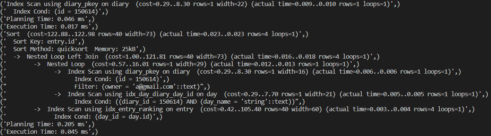

# Performance Writeup

## Fake Data Modeling

- 5,000 users: This was a value we picked based on the other numbers in other to scale to ~1,000,000 rows. We randomly generated the emails using the Faker library.
- 10,000 diaries: Each user has two diaries. Users can have multiple diaries, and although each user may not have exactly two, it does not seem outlandish for it to average out to two diaries per user. For testing purposes, it was a lot easier to do it that way because the other data relies on what values are inputted when creating the diary (i.e. the days), and it would not work out well if they were randomly generated.
- 25,000 days: In one diary, there are two days, "Upper" and "Lower", while there are three in the other: "Push", "Pull", and "Legs". Again, while it may not be the case that all users have the same routines, it was easier for testing purposes.
- 1,000,000 entries: Each diary-day has 40 entries spread apart evenly for five different exercises. The entries for the different exercises have different goal and actual values. Users going through an 8-week routine for each of their routines is definitely something that can happen. However, again, users will not have all of the same entries and values would differ across entries, but it was easier for testing purposes.
- 770 exercises: We webscraped all exercises from bodybuilding.com with ratings greater than or equal to 3.

## Performance Results

### Diary Endpoints

- POST /diary/
  

- DELETE /diary/
  

- GET /diary/all
  

- GET /diary/all/{diary_id}/{day}
  

- GET /diary/plan/{diary_id}/{day}
  

- GET /diary/previous/{diary_id}/{day}
  

### Entry Endpoints

- POST /entry/{diary_id}/{day}
  

- DELETE /entry/{entry_id}
  

- PATCH/entry/{entry_id}
  

- GET/entry/diary-day/{entry_id}
  

### Exercise Endpoint

- GET /exercise/search (no filters)
  

## Performance Tuning

### Slowest 3 Endpoints

1. GET /diary/previous/{diary_id}/{day}
   

2. GET /diary/plan/{diary_id}/{day}
   

3. GET /diary/all/{diary_id}/{day}
   

### Improvements

1. There is a parallel sequential scan on entry with filter ((reps IS NOT NULL) AND (weight IS NOT NULL)), so an index on entry (day_id, exercise, created_at DESC), since those are the values we partition by to get the rankedEntry, with that same filter may work. Also since there is a sequential scan on day, an index on day (diary_id, day_name) may also work. We were thinking that an index on diary (owner) may also do something, but it seems that it needs to do a index scan on the diary_id to check for matching ids to the one provided. There is a subquery scan that we weren't able to replace because it is a necessary subquery to get the latest entry by diary id and day name.
   
   Although this time is still a bit high, it will not matter much because it we were ever to implement a frontend for this project, the endpoint will only be called a user clicks a button to get previous goals or something of that manner.

2. Similar to (1), the same indexes, but without the filter on the index over entry, worked.
   
   The reasoning of why this does not matter much is the same as (1).

3. Similar to (2), the same indexes worked.
   
   This is very important to have good performance because it will be the main endpoint called when users access their diaries. They want to be able to access all of the information for a specific diary when they click onto it.
